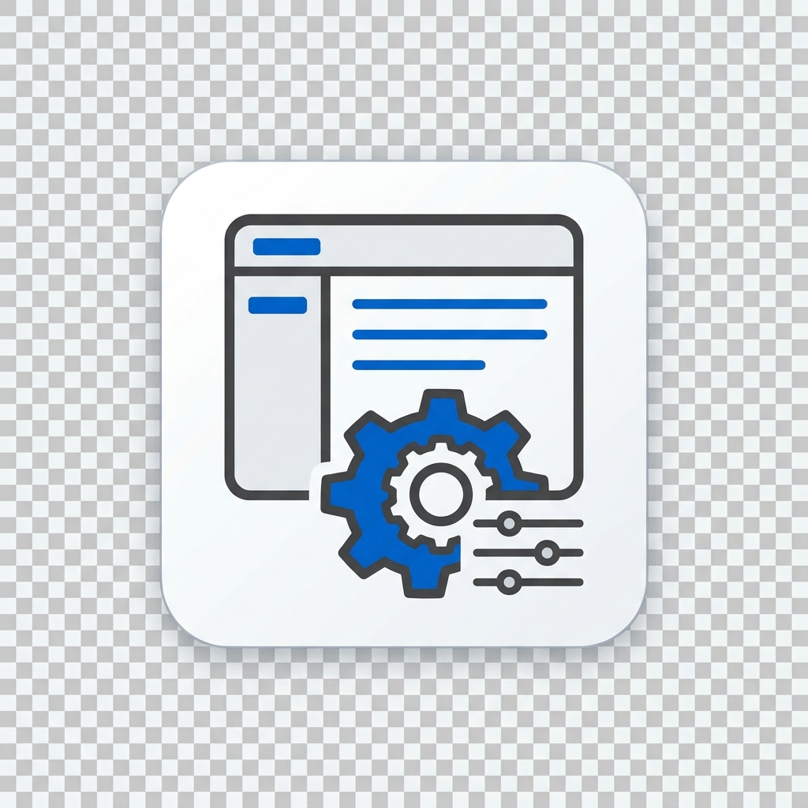

<p align="center">
  
</p>

# NetBox Custom Pages Plugin
### Creating custom web pages made easy!

**English** | [繁體中文](README_zh_TW.md) | [简体中文](README_zh_CN.md)

A powerful, highly-customizable NetBox plugin allowing administrators to create dynamic HTML/JS pages and dashboards right from the NetBox UI. It features a built-in WYSIWYG editor (Quill.js) for simple text pages, and a raw HTML/JS Code Editor (CodeMirror) for advanced API-driven dashboards.

## Features
- **Dual Editor Modes**: Choose between a Rich Text Editor (Quill.js) and a Raw HTML/JS Editor (CodeMirror).
- **Public Dashboard Directory**: A clean, read-only index page displaying all published custom pages.
- **API Proxy Support**: Securely call external APIs (Grafana, Zabbix) without leaking tokens.
- **Bulk Operations**: Dedicated Menu Editor for bulk updating display settings.
- **Import/Export**: Full support for CSV (Metadata) and JSON (Full Content) backup and portability.
- **Full i18n Support**: Ready for translation into multiple languages (v0.8.0+ includes pre-translated Traditional Chinese).
- **Enterprise Ready**: Seamlessly compatible with NetBox 4.4+.

---

## 📽️ Screenshots

### 1. Build Your Own Pages
_Call the APIs you need and craft the layout you want. Powerful, interactive, and integrated._


### 2. Centralized Management
_A streamlined administrative dashboard to manage all your custom content in one place._


### 3. Bulk Menu & Weight Editor
_Experience effortless organization. Batch edit link text, order (weights), and visibility status._


### 4. Dual-Mode Editing Flexibility
_Switch between the intuitive WYSIWYG editor for quick content and the Code Editor for precision HTML/JS control._


---

## 🛠️ Dependencies

- **NetBox**: 4.4.0+
- **Python**: 3.10+
- **Django**: 5.0+ (bundled with NetBox)

## 🔒 Security & Best Practices

### 1. Secrets Management (Proxy API)
When integrating with external systems like Grafana or Zabbix, **NEVER code your API tokens directly into the HTML/JS Editor.** 
Instead, configure your tokens securely in NetBox's `configuration.py`:

```python
PLUGINS_CONFIG = {
    'netbox_custom_pages': {
        'external_api_keys': {
            'grafana_read_only': 'Bearer eyJhbGciOiJIUz...',
            'zabbix_auth': 'Api-Token 123456789...'
        }
    }
}
```

Then, in your Custom Page JavaScript, use the built-in Plugin Proxy Endpoint:
```javascript
fetch('/api/plugins/custom-pages/proxy/', {
  method: 'POST',
  headers: {
    'Content-Type': 'application/json',
    'X-CSRFToken': document.cookie.split('csrftoken=')[1].split(';')[0]
  },
  body: JSON.stringify({
    target_url: 'https://grafana.internal/api/dashboards',
    token_key: 'grafana_read_only', // Matches the alias mapped above
    method: 'GET'
  })
})
```

### 2. Content Security Policy (CSP) Exceptions
By default, NetBox enforces strict CSP rules that block your JavaScript from connecting to external domains. 
If you choose NOT to use the Proxy Proxy and must fetch directly from an external domain, you must update the `CSP_CONNECT_SRC` in your `configuration.py`:
```python
# configuration.py
CSP_CONNECT_SRC = [
    "'self'", 
    "https://grafana.company.internal", 
    "https://zabbix.company.internal"
]
```

### 3. CSS Pollution Guidelines
When styling your custom pages, do **not** use global CSS selectors (e.g., `body { background: black; }`). Your custom pages are embedded natively into NetBox, meaning global tags will overwrite the primary NetBox layout. Always use scoped wrapper classes or default Bootstrap 5 utility classes.

---

## Compatibility Matrix

| NetBox Version | Plugin Version | Status             |
|----------------|----------------|--------------------|
| 4.4.x - 4.5.x  | 0.8.0+         | ✅ Fully Supported |
| 4.3.x          | N/A            | ❌ Not Supported   |
| < 4.2.x        | N/A            | ❌ Not Supported   |

*Note: NetBox programmatically enforces these boundaries during startup. A `PluginRequirementError` will be raised if you attempt to install this plugin on an unsupported NetBox version to prevent database or UI corruption.*

---

## 📦 Installation & Configuration

### 1. Download and Install
Assuming your NetBox installation is at `/opt/netbox`:

```bash
# Clone the repository
cd /opt
git clone https://github.com/threesecond/netbox-custom-pages.git
cd netbox-custom-pages

# Activate NetBox Virtual Environment
source /opt/netbox/venv/bin/activate

# Install the plugin (Editable mode recommended for easy updates)
pip install -e .
```

### 2. Enable the Plugin
Edit your NetBox `configuration.py` (usually at `/opt/netbox/netbox/netbox/configuration.py`):

```python
PLUGINS = [
    'netbox_custom_pages',
]

# (Optional) Configuration for API Proxy tokens
PLUGINS_CONFIG = {
    'netbox_custom_pages': {
        'external_api_keys': {
            'grafana_read_only': 'Bearer eyJhbGciOiJIUz...',
            'zabbix_auth': 'Api-Token 123456789...'
        },
        'allow_raw_js': True
    }
}
```

### 3. Run Migrations & Collect Static Files
```bash
cd /opt/netbox/netbox/
python3 manage.py migrate
python3 manage.py collectstatic --no-input
```

### 4. Restart Services
```bash
sudo systemctl restart netbox netbox-rq
```

---

## 🔄 Updating the Plugin

To update your installation to the latest version via Git:

```bash
cd /opt/netbox-custom-pages
git pull

# Apply potential database changes
source /opt/netbox/venv/bin/activate
cd /opt/netbox/netbox/
python3 manage.py migrate
python3 manage.py collectstatic --no-input

# Restart services
sudo systemctl restart netbox netbox-rq
```

---

## 🗑️ Uninstallation

To remove the plugin from NetBox:

1.  **Remove from Configuration**: Edit `configuration.py` and remove `'netbox_custom_pages'` from the `PLUGINS` list.
2.  **Uninstall using Pip**:
    ```bash
    source /opt/netbox/venv/bin/activate
    pip uninstall netbox-custom-pages
    ```
3.  **Restart Services**:
    ```bash
    sudo systemctl restart netbox netbox-rq
    ```

> [!IMPORTANT]
> Uninstalling the plugin **does not** automatically delete the custom pages database tables. If you want to completely remove all data, you must manually drop the plugin's tables (those starting with `netbox_custom_pages_`) from your database.

---

---

## 🤝 Support & Community

- **Bug Reports**: Please open an issue on [GitHub Issues](https://github.com/threesecond/netbox-custom-pages/issues).
- **Discussions**: For general questions, use [GitHub Discussions](https://github.com/threesecond/netbox-custom-pages/discussions).
- **Contributing**: We welcome pull requests! Please ensure all code passes the CI linting and tests.
