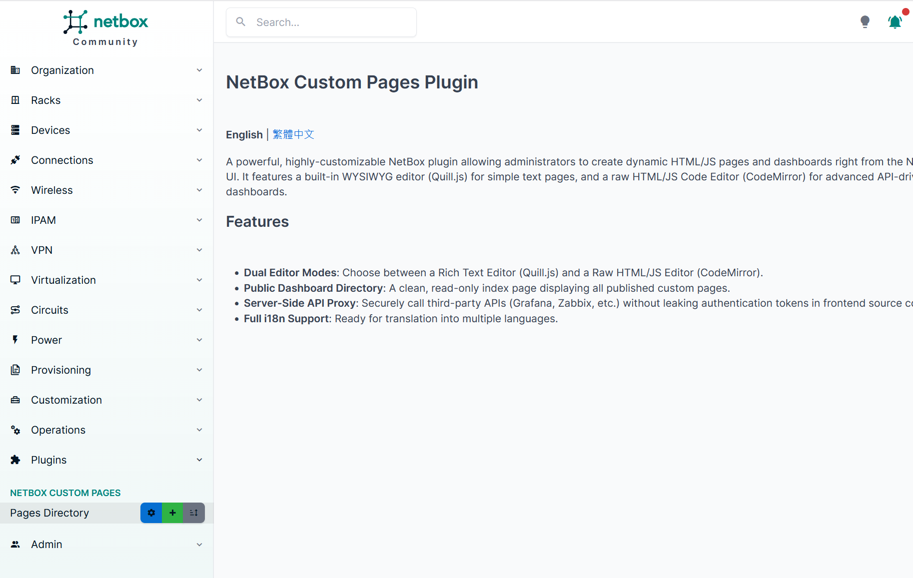
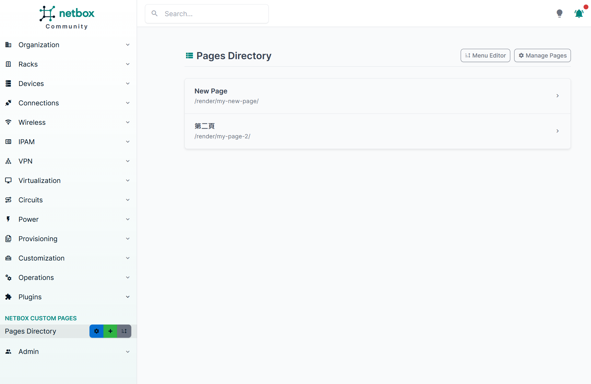
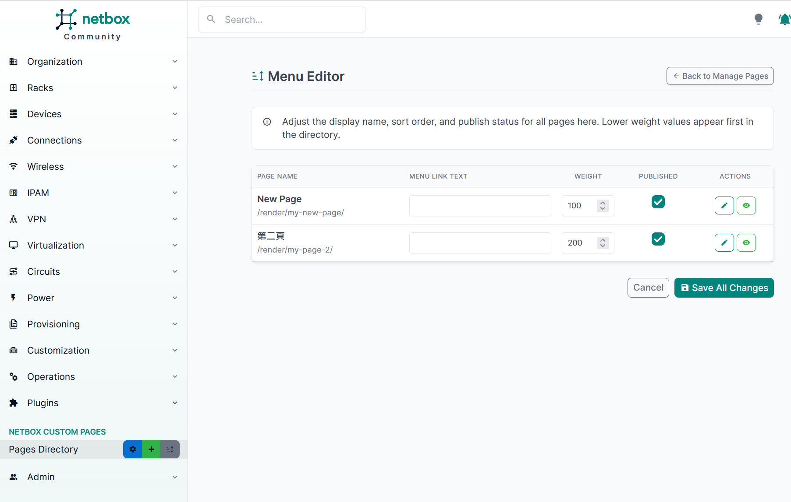
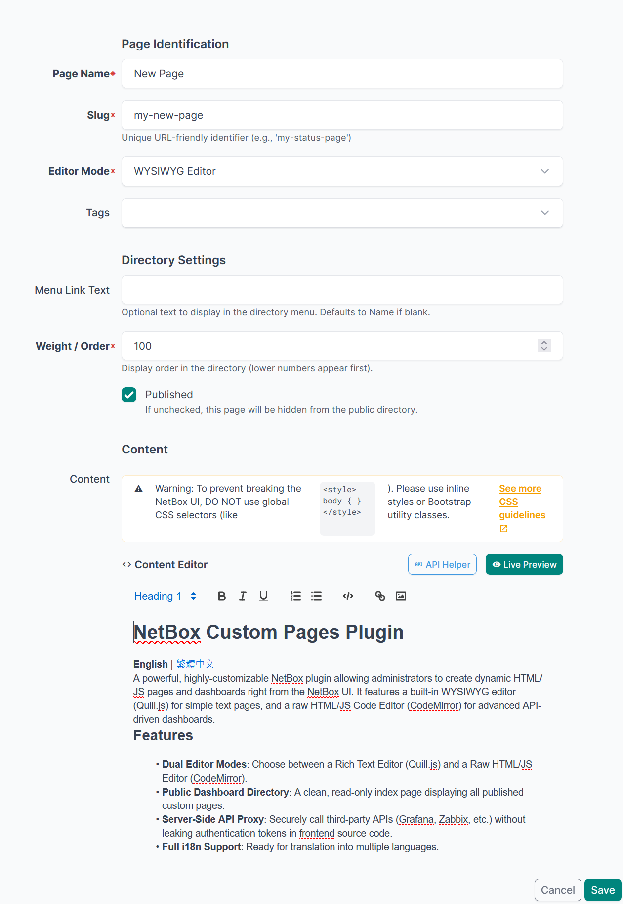
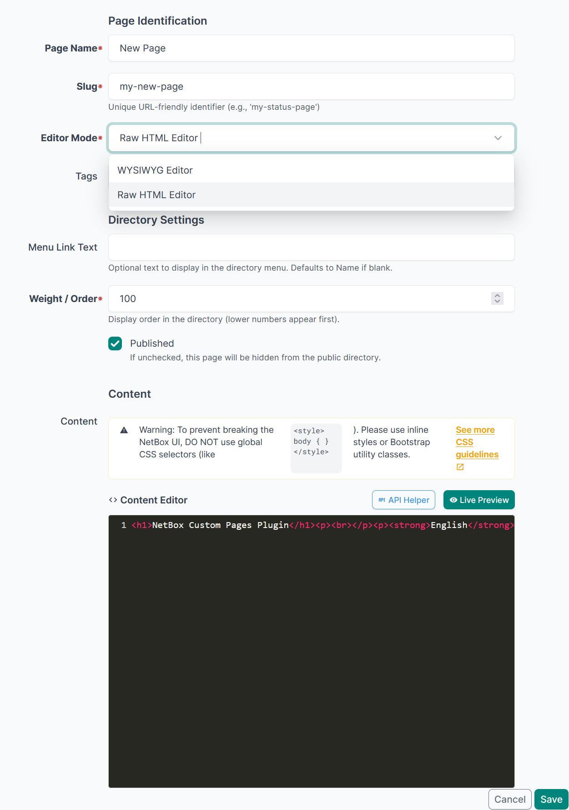

# NetBox Custom Pages 外掛程式

[English](README.md) | **繁體中文**

這是一個功能強大且高度可客製化的 NetBox 外掛程式，允許管理員直接在 NetBox 的使用者介面中，創建動態的 HTML/JS 頁面與儀表板 (Dashboards)。本外掛內建「所見即所得 (WYSIWYG)」編輯器 (Quill.js) 以供撰寫簡單圖文，同時提供「原始碼編輯器」 (CodeMirror) 供進階開發者以 API 驅動的方式開發動態儀表板。

## 功能特色 (Features)
- **雙編輯器模式 (Dual Editor Modes)**：可自由切換富文本編輯器 (Quill.js) 與純 HTML/JS 程式碼編輯器 (CodeMirror)。
- **前台目錄大廳 (Public Dashboard Directory)**：一個乾淨且唯讀的展示首頁，列出所有已發布上線的自定義頁面。
- **API 代理支援 (API Proxy Support)**：安全地呼叫外部 API (如 Grafana, Zabbix)，絕不洩露權杖 (Tokens)。
- **批次管理操作 (Bulk Operations)**：專屬的選單編輯器 (Menu Editor)，可一次調整所有頁面的顯示設定。
- **匯入與匯出 (Import/Export)**：完整支援 CSV (Metadata) 與 JSON (完整內容) 的備份與遷移。
- **完整多國語系 (Full i18n Support)**：支援多國翻譯 (v0.8.0 已內建完整繁體中文語系)。
- **企業級就緒 (Enterprise Ready)**：與 NetBox 4.4+ 版本完美相容。

---

## 📽️ 操作截圖 (Screenshots)

### 1. 前台目錄大廳 (Dashboard Hub)
一個乾淨且唯讀的展示首頁，列出所有已發布上線的自定義頁面。


### 2. 管理頁面 (Admin)
管理所有頁面，進行新增、刪除以及批次編輯。


### 3. 選單編輯器 (Menu Editor)
批次調整所有頁面的顯示文字、權重順序與發布狀態。


### 4. 雙模式編輯器 (Dual Editor)
可自由切換富文本 (WYSIWYG) 直覺編輯或是 HTML 原始碼精確控制。



---

## 🔒 資安防護與最佳實踐

### 1. 敏感資訊管理 (透過 Proxy 代理 API)
當您的頁面需要整合像是 Grafana 或 Zabbix 的機敏資料時，**絕對不可以直接將您的 API Token 寫進前端的 HTML/JS 編輯器之中**。
請改將這些具備機密性的存取權杖配置於後台 NetBox 安全的 `configuration.py` 當中：

```python
PLUGINS_CONFIG = {
    'netbox_custom_pages': {
        'external_api_keys': {
            'grafana_read_only': 'Bearer eyJhbGciOiJIUz...',
            'zabbix_auth': 'Api-Token 123456789...'
        }
    }
}
```

設定好之後，您就可以在自定義頁面的 JavaScript 當中，安心地呼叫外掛內建的代理端點 (Proxy Endpoint) 來發送請求：
```javascript
fetch('/api/plugins/custom-pages/proxy/', {
  method: 'POST',
  headers: {
    'Content-Type': 'application/json',
    'X-CSRFToken': document.cookie.split('csrftoken=')[1].split(';')[0]
  },
  body: JSON.stringify({
    target_url: 'https://grafana.internal/api/dashboards',
    token_key: 'grafana_read_only', // 上面對應的 Token 別名
    method: 'GET'
  })
})
```

### 2. 內容安全策略例外 (CSP Exceptions)
預設情況下，NetBox 實施了極為嚴格的 CSP 規則，這將會阻擋您的 JavaScript 去連線除了 `self` 以外的外部網域。
如果您決定**不使用**內建的 Proxy，並堅持讓前端直接跨網域取得資料，您必須在 `configuration.py` 手動覆寫加入 `CSP_CONNECT_SRC`：
```python
# configuration.py
CSP_CONNECT_SRC = [
    "'self'", 
    "https://grafana.company.internal", 
    "https://zabbix.company.internal"
]
```

### 3. CSS 污染防範指南
在設計您的自定義網頁樣式時，**絕對不要**使用全域性的 HTML 標籤選擇器（例如：`body { background: black; }`）。
由於您的頁面是被原生地向內坎套至 NetBox 中執行的，這意味著不帶限制的 CSS 標籤將會往外溢出並癱瘓 NetBox 自身的版面排版。請總是透過加上獨立的 Class 來限縮樣式範圍，或是直接善用預載的 Bootstrap 5 類別標籤進行排版。

---

## 系統相容性 (Compatibility)

| NetBox 版本     | 外掛版本       | 支援狀態               |
|----------------|----------------|------------------------|
| 4.4.x - 4.5.x  | 0.8.0+         | ✅ 完全支援 (Supported)|
| 4.3.x          | N/A            | ❌ 不支援 (Unsupported)|
| < 4.2.x        | N/A            | ❌ 不支援 (Unsupported)|

*注意：NetBox 系統會在服務啟動時自動強制執行這些版本邊界限制。如果您在不支援的 NetBox 版本上安裝此外掛，系統將阻擋載入並拋出 `PluginRequirementError`，以保護您的資料庫與系統介面免於毀損。*

---

## 安裝指南 (Installation)
*(標準 NetBox 外掛安裝流程...)*

1. 將 `netbox_custom_pages` 加入 `configuration.py` 的 `PLUGINS` 中。
2. 執行資料庫遷移：`python manage.py makemigrations netbox_custom_pages` 接著執行 `python manage.py migrate`。
3. 重新啟動 NetBox 的 WSGI 伺服器進程以載入更新。
